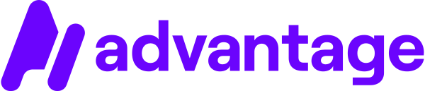

 

    <picture>
      
  </picture>

  
  

    <a href="https://stackblitz.com/github/get-advantage/advantage/tree/main?file=playground%2Fgpt%2Findex.html" target="blank">View Demo</a>
    ·
    <a href="https://github.com/get-advantage/advantage/issues/new/choose">Report Bug</a>
    ·
    <a href="https://github.com/get-advantage/advantage/issues/new/choose">Request Feature</a>

`Advantage` revolutionizes the way site owners integrate with high impact formats by providing a flexible, customizable unified API. Unlike traditional integrations that offer a one-size-fits-all solution, AdVantage empowers you to tailor the interaction between you site and high impact formats, ensuring a perfect fit for your specific needs.

## ✨ Features

-   📐 Unified Standards
-   🔒 Secure By Default
-   🛠 Flexible customization
-   👌 Ease of Use
-   ⚡️ Efficiency & Effectiveness

Read the [documentation](https://get-advantage.org) for more details!

## 🤝 Contributing to `Advantage`

Any kind of positive contribution is welcome! Please help us to grow by contributing to the project.

> Please read [`CONTRIBUTING`](CONTRIBUTING.md) for details on our [`CODE OF CONDUCT`](CODE_OF_CONDUCT.md), and the process for submitting pull requests to us.

Interested in becoming a maintainer? Check out our [Governance](GOVERNANCE.md) and [Maintainers](MAINTAINERS.md) documentation.

🆕 New to Open Source? 💡 Follow this [guide](https://opensource.guide/how-to-contribute/) to jumpstart your Open Source journey 🚀.

## Contributors ✨

Thanks goes to these wonderful people ([emoji key](https://allcontributors.org/docs/en/emoji-key)):

<!-- ALL-CONTRIBUTORS-LIST:START - Do not remove or modify this section -->
<!-- prettier-ignore-start -->
<!-- markdownlint-disable -->
<table>
  <tbody>
    <tr>
      <td align="center" valign="top" width="14.28%"><a href="https://github.com/pattan"> <b>Patrik Wilhelmsson</b></a> <a href="#doc-pattan" title="Documentation">📖</a> <a href="#ideas-pattan" title="Ideas, Planning, & Feedback">🤔</a></td>
      <td align="center" valign="top" width="14.28%"><a href="https://github.com/pontusarmini"> <b>Pontus Armini</b></a> <a href="#code-pontusarmini" title="Code">💻</a> <a href="#doc-pontusarmini" title="Documentation">📖</a> <a href="#ideas-pontusarmini" title="Ideas, Planning, & Feedback">🤔</a></td>
      <td align="center" valign="top" width="14.28%"><a href="https://github.com/rebeckasjostrom1"> <b>Rebecka Sjöström</b></a> <a href="#doc-rebeckasjostrom1" title="Documentation">📖</a> <a href="#ideas-rebeckasjostrom1" title="Ideas, Planning, & Feedback">🤔</a></td>
      <td align="center" valign="top" width="14.28%"><a href="https://github.com/dsoohn"> <b>Daniel Granlund</b></a> <a href="#design-dsoohn" title="Design">🎨</a></td>
      <td align="center" valign="top" width="14.28%"><a href="https://github.com/sannheim"> <b>Joakim Sannheim</b></a> <a href="#code-sannheim" title="Code">💻</a></td>
      <td align="center" valign="top" width="14.28%"><a href="https://github.com/erikarvidssonmadington"> <b>erikarvidssonmadington</b></a> <a href="#ideas-erikarvidssonmadington" title="Ideas, Planning, & Feedback">🤔</a></td>
      <td align="center" valign="top" width="14.28%"><a href="https://github.com/linusforsell"> <b>Linus Forsell</b></a> <a href="#doc-linusforsell" title="Documentation">📖</a> <a href="#ideas-linusforsell" title="Ideas, Planning, & Feedback">🤔</a> <a href="#code-linusforsell" title="Code">💻</a></td>
    </tr>
    <tr>
      <td align="center" valign="top" width="14.28%"><a href="http://nicolaykjaernet.com"> <b>Nicolay Kjærnet</b></a> <a href="#code-NicolayKjarnet" title="Code">💻</a> <a href="#doc-NicolayKjarnet" title="Documentation">📖</a> <a href="#ideas-NicolayKjarnet" title="Ideas, Planning, & Feedback">🤔</a></td>
    </tr>
  </tbody>
</table>

<!-- markdownlint-restore -->
<!-- prettier-ignore-end -->

<!-- ALL-CONTRIBUTORS-LIST:END -->
